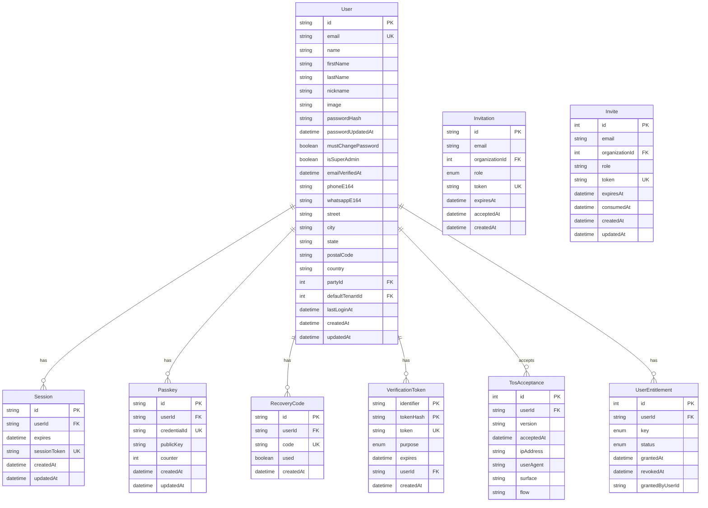

# Users & Authentication Domain

## Mermaid ERD



## DBML

```dbml
// Users & Authentication Domain

Table User {
  id varchar [pk]
  email varchar [unique, not null]
  name varchar
  firstName varchar [not null]
  lastName varchar [not null]
  nickname varchar
  image varchar
  passwordHash varchar
  passwordUpdatedAt timestamp
  mustChangePassword boolean [default: false]
  passwordSetAt timestamp
  lastPasswordChangeAt timestamp
  isSuperAdmin boolean [default: false]
  emailVerifiedAt timestamp
  phoneE164 varchar(32)
  whatsappE164 varchar(32)
  street varchar
  street2 varchar
  city varchar
  state varchar
  postalCode varchar
  country char(2)
  partyId int [ref: > Party.id]
  defaultTenantId int [ref: > Tenant.id]
  lastLoginAt timestamp
  createdAt timestamp [default: `now()`]
  updatedAt timestamp
}

Table Session {
  id varchar [pk]
  userId varchar [not null, ref: > User.id]
  expires timestamp [not null]
  sessionToken varchar [unique, not null]
  createdAt timestamp [default: `now()`]
  updatedAt timestamp
}

Table Passkey {
  id varchar [pk]
  userId varchar [not null, ref: > User.id]
  credentialId varchar [unique, not null]
  publicKey varchar [not null]
  counter int [default: 0]
  createdAt timestamp [default: `now()`]
  updatedAt timestamp
}

Table RecoveryCode {
  id varchar [pk]
  userId varchar [not null, ref: > User.id]
  code varchar [unique, not null]
  used boolean [default: false]
  createdAt timestamp [default: `now()`]
}

Table VerificationToken {
  identifier varchar [not null]
  tokenHash varchar [unique, not null]
  token varchar [unique]
  purpose VerificationPurpose [default: 'VERIFY_EMAIL']
  expires timestamp [not null]
  userId varchar [ref: > User.id]
  createdAt timestamp [default: `now()`]

  indexes {
    (identifier, tokenHash) [pk]
  }
}

Table TosAcceptance {
  id int [pk, increment]
  userId varchar [not null, ref: > User.id]
  version varchar(16) [not null]
  acceptedAt timestamp [default: `now()`]
  ipAddress varchar(45)
  userAgent text
  surface varchar(32)
  flow varchar(32)
}

Table UserEntitlement {
  id int [pk, increment]
  userId varchar [not null, ref: > User.id]
  key EntitlementKey [not null]
  status EntitlementStatus [default: 'ACTIVE']
  grantedAt timestamp [default: `now()`]
  revokedAt timestamp
  grantedByUserId varchar

  indexes {
    (userId, key) [unique]
  }
}

Table Invitation {
  id varchar [pk]
  email varchar [not null]
  organizationId int [not null, ref: > Organization.id]
  role MembershipRole [default: 'MEMBER']
  token varchar [unique, not null]
  expiresAt timestamp [not null]
  acceptedAt timestamp
  createdAt timestamp [default: `now()`]
}

Table Invite {
  id int [pk, increment]
  email varchar [not null]
  organizationId int [ref: > Organization.id]
  role varchar [default: 'STAFF']
  token varchar [unique, not null]
  expiresAt timestamp [not null]
  consumedAt timestamp
  createdAt timestamp [default: `now()`]
  updatedAt timestamp
}

Enum VerificationPurpose {
  VERIFY_EMAIL
  RESET_PASSWORD
  INVITE
  OTHER
}

Enum EntitlementKey {
  MARKETPLACE_ACCESS
}

Enum EntitlementStatus {
  ACTIVE
  REVOKED
}

Enum MembershipRole {
  OWNER
  ADMIN
  MEMBER
  VIEWER
}
```
