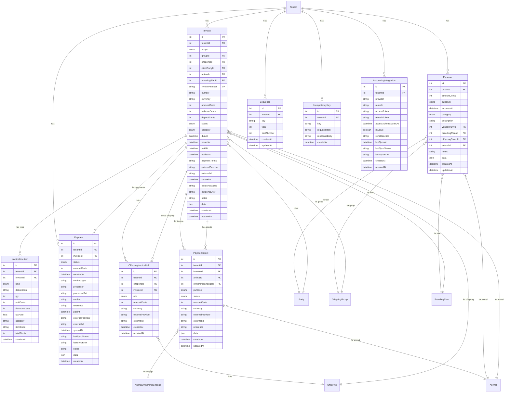

# Finance Domain

## Mermaid ERD



## DBML

```dbml
// Finance Domain

Table Invoice {
  id int [pk, increment]
  tenantId int [not null, ref: > Tenant.id]
  scope FinanceScope [not null]
  groupId int [ref: > OffspringGroup.id]
  offspringId int [ref: > Offspring.id]
  clientPartyId int [ref: > Party.id]
  animalId int [ref: > Animal.id]
  breedingPlanId int [ref: > BreedingPlan.id]
  invoiceNumber varchar [not null]
  number varchar
  currency varchar [default: 'USD']
  amountCents int [not null]
  balanceCents int [not null]
  depositCents int
  status InvoiceStatus [default: 'draft']
  category InvoiceCategory [default: 'OTHER']
  dueAt timestamp
  issuedAt timestamp
  paidAt timestamp
  voidedAt timestamp
  paymentTerms varchar
  externalProvider varchar
  externalId varchar
  syncedAt timestamp
  lastSyncStatus varchar
  lastSyncError varchar
  notes varchar
  data json
  createdAt timestamp [default: `now()`]
  updatedAt timestamp

  indexes {
    (tenantId, invoiceNumber) [unique]
  }
}

Table InvoiceLineItem {
  id int [pk, increment]
  tenantId int [not null, ref: > Tenant.id]
  invoiceId int [not null, ref: > Invoice.id]
  kind LineItemKind [default: 'OTHER']
  description varchar [not null]
  qty int [default: 1]
  unitCents int [not null]
  discountCents int
  taxRate float
  category varchar
  itemCode varchar
  totalCents int [not null]
  createdAt timestamp [default: `now()`]
}

Table Payment {
  id int [pk, increment]
  tenantId int [not null, ref: > Tenant.id]
  invoiceId int [not null, ref: > Invoice.id]
  status PaymentStatus [default: 'pending']
  amountCents int [not null]
  receivedAt timestamp [not null]
  methodType varchar
  processor varchar
  processorRef varchar
  method varchar
  reference varchar
  paidAt timestamp
  externalProvider varchar
  externalId varchar
  syncedAt timestamp
  lastSyncStatus varchar
  lastSyncError varchar
  notes varchar
  data json
  createdAt timestamp [default: `now()`]
}

Table Expense {
  id int [pk, increment]
  tenantId int [not null, ref: > Tenant.id]
  amountCents int [not null]
  currency varchar [default: 'USD']
  incurredAt timestamp [not null]
  category ExpenseCategory [not null]
  description varchar
  vendorPartyId int [ref: > Party.id]
  breedingPlanId int [ref: > BreedingPlan.id]
  offspringGroupId int [ref: > OffspringGroup.id]
  animalId int [ref: > Animal.id]
  notes varchar
  data json
  createdAt timestamp [default: `now()`]
  updatedAt timestamp
}

Table PaymentIntent {
  id int [pk, increment]
  tenantId int [not null, ref: > Tenant.id]
  invoiceId int [ref: > Invoice.id]
  animalId int [ref: > Animal.id]
  ownershipChangeId int [ref: > AnimalOwnershipChange.id]
  purpose PaymentIntentPurpose [not null]
  status PaymentIntentStatus [default: 'PLANNED']
  amountCents int [not null]
  currency varchar(3) [not null]
  externalProvider varchar
  externalId varchar
  reference varchar
  data json
  createdAt timestamp [default: `now()`]
  updatedAt timestamp
}

Table Sequence {
  id int [pk, increment]
  tenantId int [not null, ref: > Tenant.id]
  key varchar [not null]
  year int [not null]
  nextNumber int [default: 1]
  createdAt timestamp [default: `now()`]
  updatedAt timestamp

  indexes {
    (tenantId, key, year) [unique]
  }
}

Table IdempotencyKey {
  id int [pk, increment]
  tenantId int [not null, ref: > Tenant.id]
  key varchar [not null]
  requestHash varchar [not null]
  responseBody varchar
  createdAt timestamp [default: `now()`]

  indexes {
    (tenantId, key) [unique]
  }
}

Table OffspringInvoiceLink {
  id int [pk, increment]
  tenantId int [not null, ref: > Tenant.id]
  offspringId int [not null, ref: > Offspring.id]
  invoiceId int [ref: > Invoice.id]
  role InvoiceRole [default: 'MISC']
  amountCents int
  currency varchar
  externalProvider varchar
  externalId varchar
  createdAt timestamp [default: `now()`]
  updatedAt timestamp

  indexes {
    (offspringId, invoiceId, role) [unique]
  }
}

Table AccountingIntegration {
  id int [pk, increment]
  tenantId int [not null, ref: > Tenant.id]
  provider varchar [not null]
  realmId varchar [not null]
  accessToken varchar [not null]
  refreshToken varchar [not null]
  accessTokenExpiresAt timestamp [not null]
  isActive boolean [default: true]
  syncDirection varchar [default: 'outbound']
  lastSyncAt timestamp
  lastSyncStatus varchar
  lastSyncError varchar
  createdAt timestamp [default: `now()`]
  updatedAt timestamp
}

Enum FinanceScope {
  group
  offspring
  contact
  organization
  general
}

Enum InvoiceStatus {
  draft
  issued
  partially_paid
  paid
  void
  uncollectible
  refunded
  cancelled
}

Enum InvoiceCategory {
  DEPOSIT
  SERVICE
  GOODS
  MIXED
  OTHER
}

Enum LineItemKind {
  DEPOSIT
  SERVICE_FEE
  GOODS
  DISCOUNT
  TAX
  OTHER
}

Enum PaymentStatus {
  pending
  succeeded
  failed
  refunded
  disputed
  cancelled
}

Enum ExpenseCategory {
  VETERINARY
  FEED
  SUPPLIES
  BREEDING_FEE
  BOARDING
  TRAINING
  TRANSPORT
  MARKETING
  ADMINISTRATIVE
  FACILITIES
  INSURANCE
  OTHER
}

Enum PaymentIntentPurpose {
  DEPOSIT
  PURCHASE
  STUD_FEE
  BOARDING
  TRAINING
  OTHER
}

Enum PaymentIntentStatus {
  PLANNED
  EXTERNAL
  COMPLETED
  CANCELED
}

Enum InvoiceRole {
  RESERVATION
  DEPOSIT
  FINAL
  MISC
}
```
