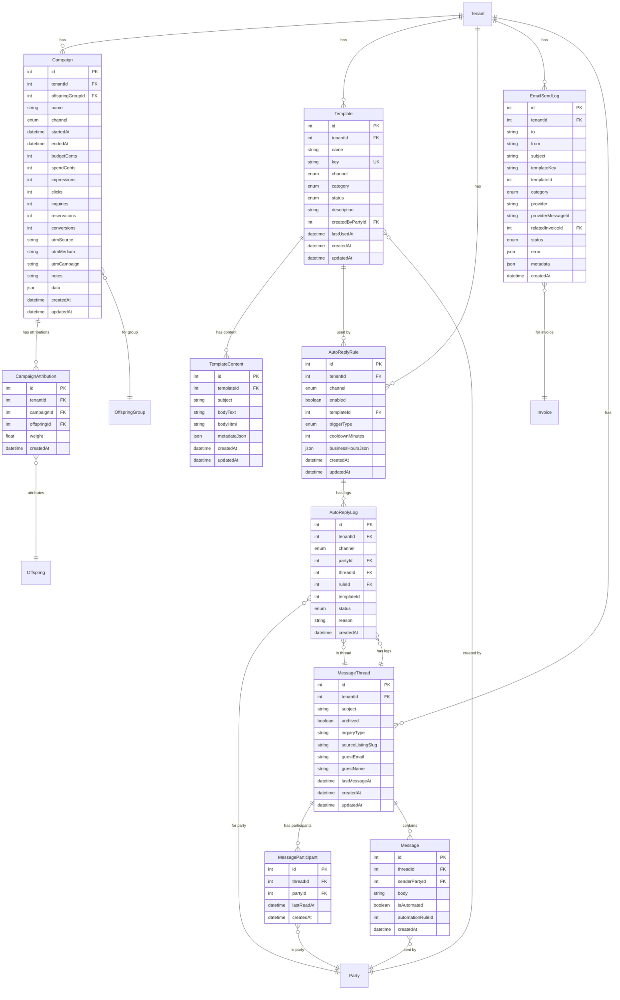

# Marketing & Messaging Domain

## Mermaid ERD



## DBML

```dbml
// Marketing & Messaging Domain

Table Campaign {
  id int [pk, increment]
  tenantId int [not null, ref: > Tenant.id]
  offspringGroupId int [ref: > OffspringGroup.id]
  name varchar [not null]
  channel CampaignChannel [not null]
  startedAt timestamp
  endedAt timestamp
  budgetCents int
  spendCents int
  impressions int
  clicks int
  inquiries int
  reservations int
  conversions int
  utmSource varchar
  utmMedium varchar
  utmCampaign varchar
  notes varchar
  data json
  createdAt timestamp [default: `now()`]
  updatedAt timestamp
}

Table CampaignAttribution {
  id int [pk, increment]
  tenantId int [not null, ref: > Tenant.id]
  campaignId int [not null, ref: > Campaign.id]
  offspringId int [ref: > Offspring.id]
  weight float
  createdAt timestamp [default: `now()`]
}

Table Template {
  id int [pk, increment]
  tenantId int [not null, ref: > Tenant.id]
  name varchar [not null]
  key varchar
  channel TemplateChannel [not null]
  category TemplateCategory [not null]
  status TemplateStatus [default: 'draft']
  description text
  createdByPartyId int [ref: > Party.id]
  lastUsedAt timestamp
  createdAt timestamp [default: `now()`]
  updatedAt timestamp

  indexes {
    (tenantId, key) [unique]
  }
}

Table TemplateContent {
  id int [pk, increment]
  templateId int [not null, ref: > Template.id]
  subject varchar
  bodyText text [not null]
  bodyHtml text
  metadataJson json
  createdAt timestamp [default: `now()`]
  updatedAt timestamp
}

Table AutoReplyRule {
  id int [pk, increment]
  tenantId int [not null, ref: > Tenant.id]
  channel TemplateChannel [not null]
  enabled boolean [default: true]
  templateId int [not null, ref: > Template.id]
  triggerType AutoReplyTriggerType [not null]
  cooldownMinutes int [default: 60]
  businessHoursJson json
  createdAt timestamp [default: `now()`]
  updatedAt timestamp
}

Table AutoReplyLog {
  id int [pk, increment]
  tenantId int [not null, ref: > Tenant.id]
  channel TemplateChannel [not null]
  partyId int [not null, ref: > Party.id]
  threadId int [ref: > MessageThread.id]
  ruleId int [ref: > AutoReplyRule.id]
  templateId int
  status AutoReplyStatus [not null]
  reason text
  createdAt timestamp [default: `now()`]
}

Table EmailSendLog {
  id int [pk, increment]
  tenantId int [not null, ref: > Tenant.id]
  to varchar [not null]
  from varchar [not null]
  subject varchar [not null]
  templateKey varchar
  templateId int
  category EmailSendCategory
  provider varchar [default: 'resend']
  providerMessageId varchar
  relatedInvoiceId int [ref: > Invoice.id]
  status EmailSendStatus [default: 'queued']
  error json
  metadata json
  createdAt timestamp [default: `now()`]

  indexes {
    (tenantId, templateKey, relatedInvoiceId) [unique]
  }
}

Table MessageThread {
  id int [pk, increment]
  tenantId int [not null, ref: > Tenant.id]
  subject varchar
  archived boolean [default: false]
  inquiryType varchar
  sourceListingSlug varchar
  guestEmail varchar
  guestName varchar
  lastMessageAt timestamp
  createdAt timestamp [default: `now()`]
  updatedAt timestamp
}

Table MessageParticipant {
  id int [pk, increment]
  threadId int [not null, ref: > MessageThread.id]
  partyId int [not null, ref: > Party.id]
  lastReadAt timestamp
  createdAt timestamp [default: `now()`]

  indexes {
    (threadId, partyId) [unique]
  }
}

Table Message {
  id int [pk, increment]
  threadId int [not null, ref: > MessageThread.id]
  senderPartyId int [not null, ref: > Party.id]
  body text [not null]
  isAutomated boolean [default: false]
  automationRuleId int
  createdAt timestamp [default: `now()`]
}

Enum CampaignChannel {
  email
  social
  ads
  marketplace
  website
  other
}

Enum TemplateChannel {
  email
  dm
  social
}

Enum TemplateStatus {
  draft
  active
  archived
}

Enum TemplateCategory {
  auto_reply
  invoice_message
  birth_announcement
  waitlist_update
  general_follow_up
  custom
}

Enum AutoReplyTriggerType {
  dm_first_message_from_party
  dm_after_hours
}

Enum AutoReplyStatus {
  sent
  skipped
  failed
}

Enum EmailSendStatus {
  queued
  sent
  failed
}

Enum EmailSendCategory {
  transactional
  marketing
}
```
