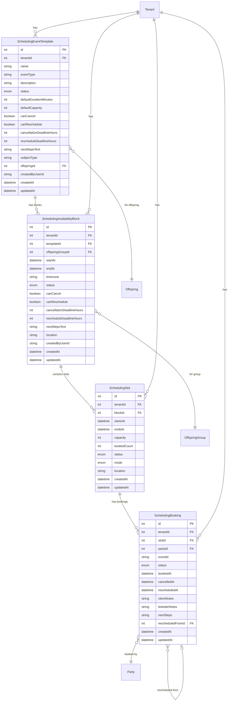

# Scheduling Domain

## Mermaid ERD



## DBML

```dbml
// Scheduling Domain

Table SchedulingEventTemplate {
  id int [pk, increment]
  tenantId int [not null, ref: > Tenant.id]
  name varchar [not null]
  eventType varchar [not null]
  description text
  status SchedulingEventStatus [default: 'DRAFT']
  defaultDurationMinutes int [default: 60]
  defaultCapacity int [default: 1]
  canCancel boolean [default: true]
  canReschedule boolean [default: true]
  cancellationDeadlineHours int
  rescheduleDeadlineHours int
  nextStepsText text
  subjectType varchar
  offspringId int [ref: > Offspring.id]
  createdByUserId varchar
  createdAt timestamp [default: `now()`]
  updatedAt timestamp
}

Table SchedulingAvailabilityBlock {
  id int [pk, increment]
  tenantId int [not null, ref: > Tenant.id]
  templateId int [ref: > SchedulingEventTemplate.id]
  offspringGroupId int [ref: > OffspringGroup.id]
  startAt timestamp [not null]
  endAt timestamp [not null]
  timezone varchar(64) [default: 'America/New_York']
  status SchedulingEventStatus [default: 'OPEN']
  canCancel boolean
  canReschedule boolean
  cancellationDeadlineHours int
  rescheduleDeadlineHours int
  nextStepsText text
  location text
  createdByUserId varchar
  createdAt timestamp [default: `now()`]
  updatedAt timestamp
}

Table SchedulingSlot {
  id int [pk, increment]
  tenantId int [not null, ref: > Tenant.id]
  blockId int [not null, ref: > SchedulingAvailabilityBlock.id]
  startsAt timestamp [not null]
  endsAt timestamp [not null]
  capacity int [default: 1]
  bookedCount int [default: 0]
  status SchedulingSlotStatus [default: 'AVAILABLE']
  mode SchedulingSlotMode
  location text
  createdAt timestamp [default: `now()`]
  updatedAt timestamp
}

Table SchedulingBooking {
  id int [pk, increment]
  tenantId int [not null, ref: > Tenant.id]
  slotId int [not null, ref: > SchedulingSlot.id]
  partyId int [not null, ref: > Party.id]
  eventId varchar(64) [not null]
  status SchedulingBookingStatus [default: 'CONFIRMED']
  bookedAt timestamp [default: `now()`]
  cancelledAt timestamp
  rescheduledAt timestamp
  clientNotes text
  breederNotes text
  nextSteps text
  rescheduledFromId int [ref: > SchedulingBooking.id]
  createdAt timestamp [default: `now()`]
  updatedAt timestamp

  indexes {
    (slotId, partyId) [unique]
  }
}

Enum SchedulingEventStatus {
  DRAFT
  OPEN
  CLOSED
  CANCELLED
}

Enum SchedulingSlotStatus {
  AVAILABLE
  FULL
  CANCELLED
}

Enum SchedulingSlotMode {
  IN_PERSON
  VIRTUAL
}

Enum SchedulingBookingStatus {
  CONFIRMED
  CANCELLED
  RESCHEDULED
  NO_SHOW
}
```
