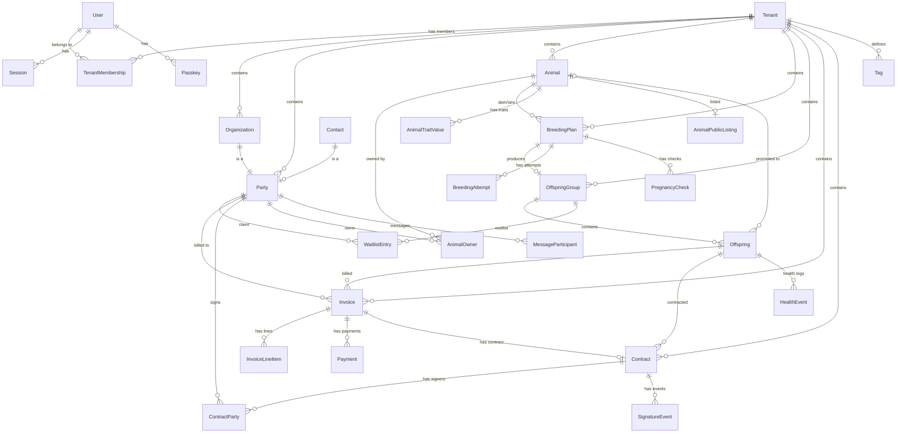
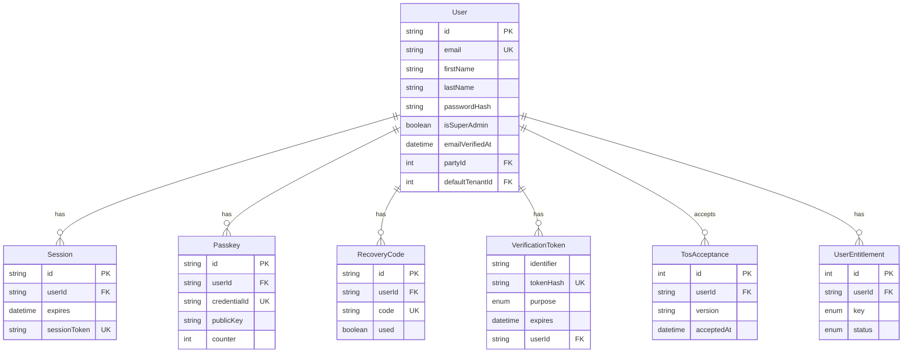
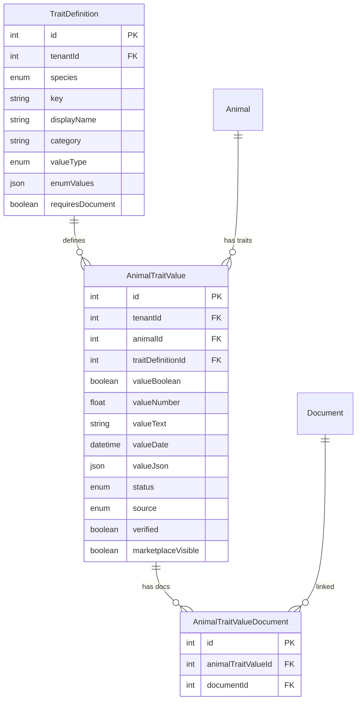
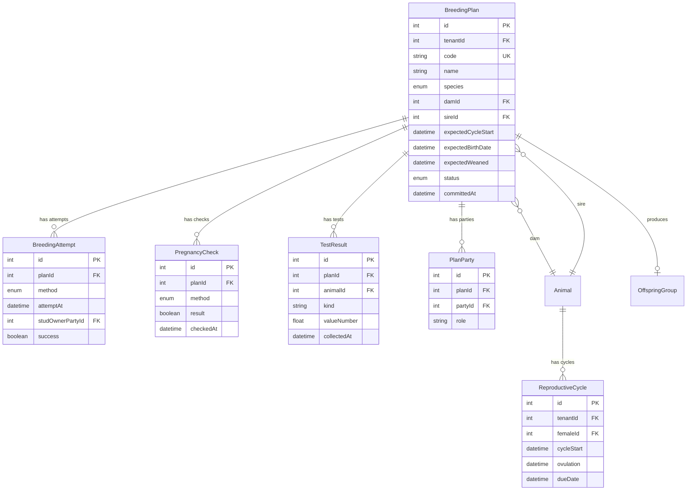
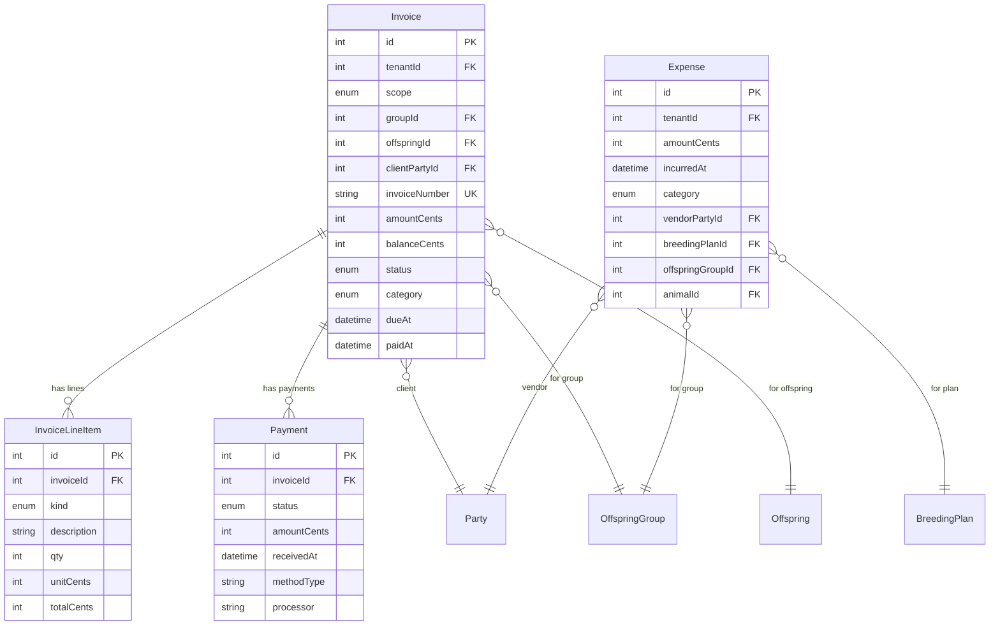
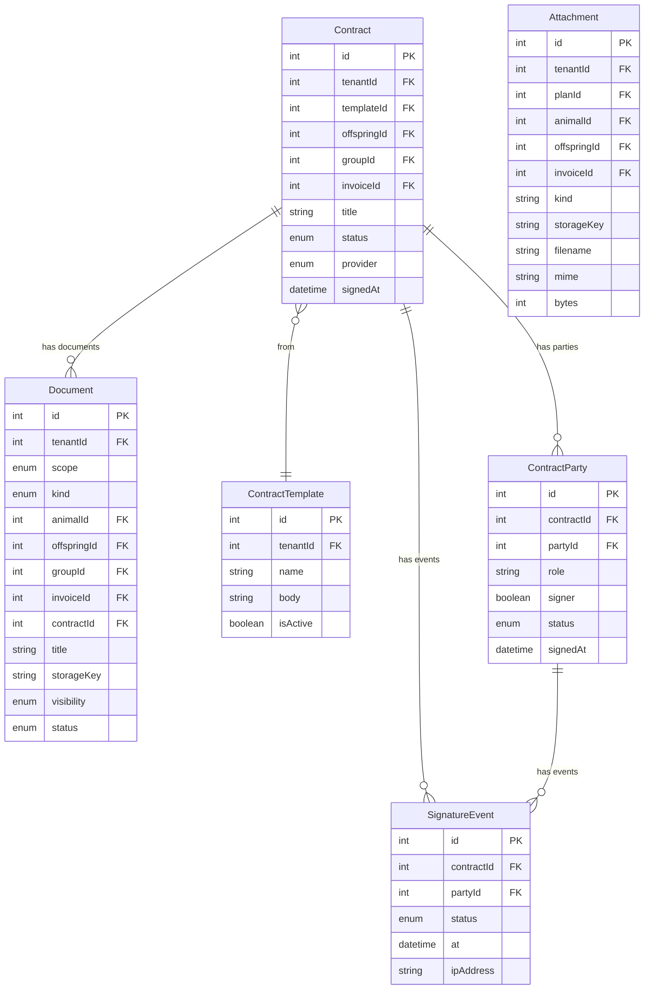
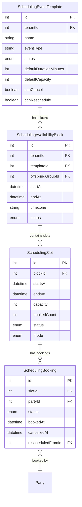
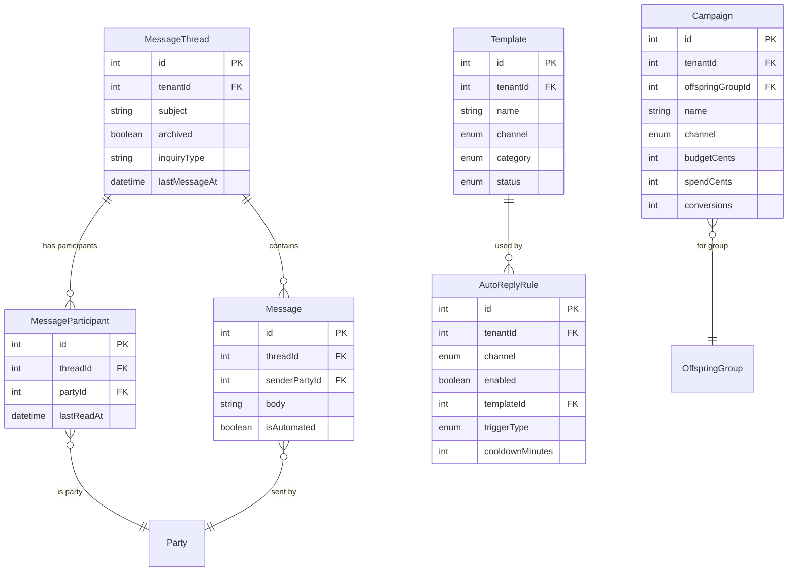

# Data Models & ERDs

## Purpose

This section documents the **entity relationship diagrams (ERDs)** and data models that power BreederHQ. It provides a visual and structured way to understand how data flows across modules, how entities relate to one another, and where shared components (tags, traits, audit logs) integrate.

## Scope (what this section covers)

- Master ERD (all modules together)
- Per-module ERDs (Users/Auth, Tenants/Orgs, Animals, Breeding, Offspring, Finance, Documents, Scheduling)
- Cross-module relationships (e.g., Party ↔ Invoice ↔ Offspring)
- Data isolation (per tenant)
- Notes on entity ownership and cardinality (one-to-many, many-to-many)

---

## Schema Statistics

| Metric | Count |
|--------|-------|
| Total Models | ~75 |
| Total Enums | ~50+ |
| Core Entity Types | User, Tenant, Party, Animal, Offspring, Invoice, Contract |

---

## Master ERD

The master ERD shows the high-level relationships between all major entity groups:



This diagram shows:
- **Users ↔ Tenants** (many-to-many via TenantMembership)
- **Party as unified identity** (Contact or Organization)
- **Parties ↔ Invoices** (one-to-many)
- **Parties ↔ Waitlist** (one-to-many)
- **BreedingPlan ↔ OffspringGroup** (one-to-one)
- **Offspring ↔ Animals** (promotion path)
- **Animals ↔ Breeding Plans ↔ Cycles**
- **Tags, Traits, Audit Logs, Documents** applied to all entities

---

## Per-Module ERDs

### 1. Users & Authentication



**Key Models:**
| Model | Purpose |
|-------|---------|
| User | Core user account with auth credentials |
| Session | Active login sessions |
| Passkey | WebAuthn/FIDO2 credentials |
| RecoveryCode | Backup codes for account recovery |
| VerificationToken | Email verification, password reset |
| TosAcceptance | Terms of Service acceptance audit |
| UserEntitlement | Feature access grants (e.g., marketplace) |

---

### 2. Tenants & Organizations

```mermaid
erDiagram
    Tenant {
        int id PK
        string name
        string slug UK
        string primaryEmail
        enum operationType
    }

    TenantMembership {
        string userId PK_FK
        int tenantId PK_FK
        enum role
        enum membershipRole
        enum membershipStatus
        int partyId FK
    }

    BillingAccount {
        int id PK
        int tenantId FK_UK
        string provider
        string customerId
        string subscriptionId
    }

    Organization {
        int id PK
        int tenantId FK
        int partyId FK_UK
        string name
        string programSlug
        boolean isPublicProgram
    }

    Party {
        int id PK
        int tenantId FK
        enum type
        string name
        string email
        string phoneE164
        boolean archived
    }

    Contact {
        int id PK
        int tenantId FK
        int partyId FK_UK
        string display_name
        string email
        string phoneE164
    }

    Tenant ||--o{ TenantMembership : "has members"
    Tenant ||--o| BillingAccount : "has billing"
    Tenant ||--o{ Organization : "contains"
    Tenant ||--o{ Party : "contains"
    Tenant ||--o{ Contact : "contains"

    Organization ||--|| Party : "is a"
    Organization ||--o{ Contact : "has contacts"
    Contact ||--o| Party : "is a"

    User ||--o{ TenantMembership : "belongs to"
```

**Key Relationships:**
| From | To | Type | Notes |
|------|-----|------|-------|
| User | Tenant | Many-to-Many | Via TenantMembership |
| Tenant | Organization | One-to-Many | Tenant contains orgs |
| Party | Organization | One-to-One | Organization IS a Party |
| Party | Contact | One-to-One | Contact IS a Party |
| Organization | Contact | One-to-Many | Org has contacts |

**Party Pattern:** The `Party` model is a unified identity abstraction. Both `Organization` and `Contact` extend Party, allowing invoices, contracts, messages, and other entities to reference a single `partyId` instead of separate contact/org foreign keys.

---

### 3. Animals

```mermaid
erDiagram
    Animal {
        int id PK
        int tenantId FK
        int organizationId FK
        string name
        enum species
        enum sex
        enum status
        datetime birthDate
        string microchip
        int canonicalBreedId FK
        int customBreedId FK
        int buyerPartyId FK
    }

    AnimalOwner {
        int id PK
        int animalId FK
        int partyId FK
        int percent
        boolean isPrimary
    }

    Breed {
        int id PK
        string name UK
        string slug UK
        enum species
    }

    AnimalBreed {
        int id PK
        int animalId FK
        int breedId FK
        float percentage
    }

    Registry {
        int id PK
        string name
        string code UK
        enum species
    }

    AnimalRegistryIdentifier {
        int id PK
        int animalId FK
        int registryId FK
        string identifier
    }

    AnimalShare {
        int id PK
        int animalId FK
        int fromTenantId FK
        int toTenantId FK
        enum scope
        enum status
    }

    AnimalPublicListing {
        int id PK
        int animalId FK_UK
        int tenantId FK
        string urlSlug UK
        enum intent
        enum status
    }

    Animal ||--o{ AnimalOwner : "owned by"
    Animal ||--o{ AnimalBreed : "has breeds"
    Animal ||--o{ AnimalRegistryIdentifier : "registered with"
    Animal ||--o{ AnimalShare : "shared"
    Animal ||--o| AnimalPublicListing : "has listing"
    Animal }o--|| Breed : "canonical breed"
    AnimalBreed }o--|| Breed : "references"
    AnimalRegistryIdentifier }o--|| Registry : "references"
    Party ||--o{ AnimalOwner : "owns"
```

**Species Supported:** DOG, CAT, HORSE, GOAT, RABBIT, SHEEP

**Key Models:**
| Model | Purpose |
|-------|---------|
| Animal | Core animal record |
| AnimalOwner | Ownership percentages (supports co-ownership) |
| Breed | Canonical breed definitions |
| AnimalBreed | Mixed breed support (multiple breeds per animal) |
| Registry | AKC, CKC, AMHA, etc. |
| AnimalRegistryIdentifier | Registration numbers per registry |
| AnimalShare | Cross-tenant sharing |
| AnimalPublicListing | Marketplace listings |

---

### 4. Traits System



**Trait Value Types:** BOOLEAN, ENUM, NUMBER, DATE, TEXT, JSON

**Trait Sources:** SELF_REPORTED, VET, LAB, REGISTRY

---

### 5. Breeding



**Breeding Plan Status Flow:**
```
PLANNING → COMMITTED → CYCLE_EXPECTED → HORMONE_TESTING → BRED → PREGNANT → BIRTHED → WEANED → PLACEMENT → COMPLETE
                                                                                                    ↓
                                                                                                CANCELED
```

**Breeding Methods:** NATURAL, AI_TCI, AI_SI, AI_FROZEN

---

### 6. Offspring & Litters

```mermaid
erDiagram
    OffspringGroup {
        int id PK
        int tenantId FK
        int planId FK_UK
        enum species
        int damId FK
        int sireId FK
        string name
        datetime actualBirthOn
        int countBorn
        int countLive
        int countWeaned
        int countPlaced
        boolean published
        string listingSlug
    }

    Offspring {
        int id PK
        int groupId FK
        string name
        enum species
        enum sex
        datetime bornAt
        enum status
        enum lifeState
        enum placementState
        enum keeperIntent
        enum financialState
        enum paperworkState
        int buyerPartyId FK
        int priceCents
        int promotedAnimalId FK
    }

    WaitlistEntry {
        int id PK
        int tenantId FK
        int planId FK
        int offspringGroupId FK
        int clientPartyId FK
        enum status
        int priority
        int depositPaidCents
        int offspringId FK
    }

    OffspringGroupBuyer {
        int id PK
        int groupId FK
        int buyerPartyId FK
        int waitlistEntryId FK
        int placementRank
    }

    OffspringGroup ||--o{ Offspring : "contains"
    OffspringGroup ||--o{ WaitlistEntry : "has waitlist"
    OffspringGroup ||--o{ OffspringGroupBuyer : "has buyers"
    OffspringGroup }o--|| BreedingPlan : "from plan"

    Offspring }o--|| Party : "buyer"
    Offspring }o--o| Animal : "promoted to"
    Offspring ||--o{ WaitlistEntry : "allocated"

    WaitlistEntry }o--|| Party : "client"
```

**Offspring Lifecycle States:**

| Dimension | Values |
|-----------|--------|
| lifeState | ALIVE, DECEASED |
| placementState | UNASSIGNED, OPTION_HOLD, RESERVED, PLACED, RETURNED, TRANSFERRED |
| keeperIntent | AVAILABLE, UNDER_EVALUATION, WITHHELD, KEEP |
| financialState | NONE, DEPOSIT_PENDING, DEPOSIT_PAID, PAID_IN_FULL, REFUNDED, CHARGEBACK |
| paperworkState | NONE, SENT, SIGNED, COMPLETE |

**Waitlist Status Flow:**
```
INQUIRY → DEPOSIT_DUE → DEPOSIT_PAID → READY → ALLOCATED → COMPLETED
                                                    ↓
                                                CANCELED
```

---

### 7. Finance



**Invoice Status Flow:**
```
draft → issued → partially_paid → paid
           ↓           ↓
         void    uncollectible → refunded
           ↓
       cancelled
```

**Expense Categories:** VETERINARY, FEED, SUPPLIES, BREEDING_FEE, BOARDING, TRAINING, TRANSPORT, MARKETING, ADMINISTRATIVE, FACILITIES, INSURANCE, OTHER

---

### 8. Documents & Contracts



**Contract Status Flow:**
```
draft → sent → viewed → signed
          ↓       ↓
       expired  declined
          ↓
        voided
```

**Document Kinds:** generic, health_certificate, registration, contract_pdf, invoice_pdf, photo, bill_of_sale, syndication_agreement, lease_agreement, insurance_policy, vet_certificate

---

### 9. Scheduling



**Slot Modes:** IN_PERSON, VIRTUAL

**Booking Status:** CONFIRMED, CANCELLED, RESCHEDULED, NO_SHOW

---

### 10. Marketing & Messaging



---

### 11. Portal Access & Audit

```mermaid
erDiagram
    PortalAccess {
        int id PK
        int tenantId FK
        int partyId FK_UK
        enum status
        string userId FK
        datetime activatedAt
        datetime lastLoginAt
    }

    PortalInvite {
        int id PK
        int tenantId FK
        int partyId FK
        string emailNorm
        string tokenHash UK
        datetime expiresAt
        datetime usedAt
    }

    AuditEvent {
        int id PK
        datetime createdAt
        string userId
        enum surface
        enum actorContext
        int tenantId
        string action
        enum outcome
        json detailJson
    }

    Tag {
        int id PK
        int tenantId FK
        string name
        enum module
        string color
        boolean isArchived
    }

    TagAssignment {
        int id PK
        int tagId FK
        int taggedPartyId FK
        int animalId FK
        int offspringId FK
    }

    PortalAccess ||--|| Party : "for party"
    PortalAccess }o--|| User : "linked user"

    PortalInvite }o--|| Party : "for party"

    Tag ||--o{ TagAssignment : "has"
    TagAssignment }o--|| Party : "tags"
    TagAssignment }o--|| Animal : "tags"
    TagAssignment }o--|| Offspring : "tags"
```

**Portal Access Status:** NO_ACCESS, INVITED, ACTIVE, SUSPENDED

**Audit Surfaces:** PLATFORM, PORTAL, MARKETPLACE

**Tag Modules:** CONTACT, ORGANIZATION, ANIMAL, WAITLIST_ENTRY, OFFSPRING_GROUP, OFFSPRING

---

## Shared Components (applied across entities)

| Service | Description |
|---------|-------------|
| **Tags** | Tenant-scoped tags can be applied to Contacts, Organizations, Animals, Waitlist Entries, Offspring Groups, Offspring |
| **Traits** | Species-specific trait definitions with typed values (boolean, enum, number, date, text, json) |
| **Documents** | Documents/attachments can be linked to any entity via scope field |
| **Audit Log** | Immutable event log for auth, access control, and abuse monitoring |
| **Portal Access** | Client portal grants per Party |

---

## Data Isolation

All tenant-scoped data is isolated by `tenantId`. Key isolation patterns:

1. **Row-level security** - Every tenant-scoped table has a `tenantId` foreign key
2. **Unique constraints** - Many unique constraints are scoped to tenant (e.g., `@@unique([tenantId, email])`)
3. **Cascading deletes** - Tenant deletion cascades to all child records
4. **Cross-tenant sharing** - Explicit share models (`AnimalShare`, `BreedingPlanShare`) for controlled access

---

## Key Enums Reference

### Core Enums

| Enum | Values |
|------|--------|
| Species | DOG, CAT, HORSE, GOAT, RABBIT, SHEEP |
| Sex | MALE, FEMALE |
| AnimalStatus | ACTIVE, BREEDING, UNAVAILABLE, RETIRED, DECEASED, PROSPECT |
| TenantRole | OWNER, ADMIN, MEMBER, BILLING, VIEWER |
| TenantMembershipRole | STAFF, CLIENT |

### Status Enums

| Enum | Values |
|------|--------|
| BreedingPlanStatus | PLANNING, COMMITTED, CYCLE_EXPECTED, HORMONE_TESTING, BRED, PREGNANT, BIRTHED, WEANED, PLACEMENT, COMPLETE, CANCELED |
| WaitlistStatus | INQUIRY, DEPOSIT_DUE, DEPOSIT_PAID, READY, ALLOCATED, COMPLETED, CANCELED |
| InvoiceStatus | draft, issued, partially_paid, paid, void, uncollectible, refunded, cancelled |
| ContractStatus | draft, sent, viewed, signed, declined, voided, expired |

---

## Out of Scope (v1)

- Historical schema migrations (covered in Migrations & Versions page)
- Advanced analytics data models
- External system ERDs (registries, Stripe, etc.)

---

## Definition of Done (v1)

- [x] Master ERD documenting all modules
- [x] Per-module ERDs (Users/Auth, Tenants/Orgs, Animals, Breeding, Offspring, Finance, Documents, Scheduling, Marketing, Portal)
- [x] Cross-module relationships documented
- [x] Shared components (Tags, Traits, Documents, Audit) clearly shown
- [x] All enums documented
- [x] Data isolation patterns documented

---

*Last updated: January 2026*
*Source: Generated from `prisma/schema.prisma`*
